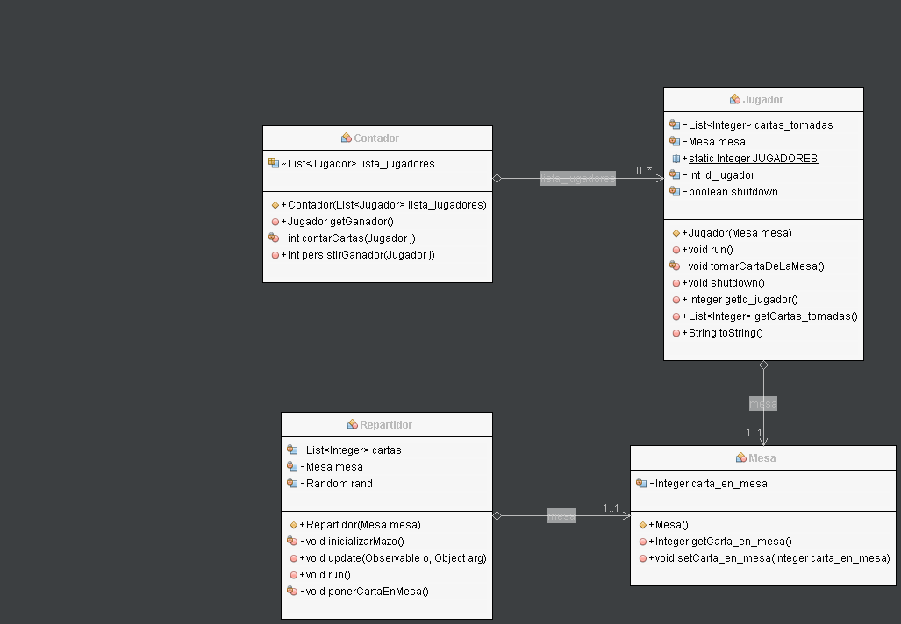

# TP-3-CARTAS

**Persistencia utilizada**

Se utilizo MariaDB ya que estoy altamente familizarizado con MySQL y este es un fork compatible con dicha tecnologia. La conexion y persistencia a base de datos se ha realizado con JDBC tal como lo dictado en clase.

**Realizar un UML y adjuntarlo**

